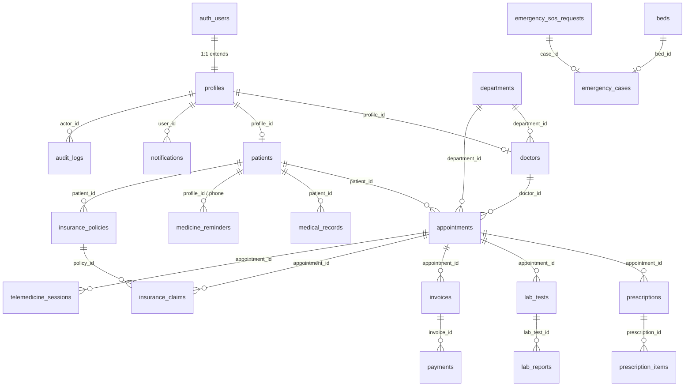

# MEDILINK Healthcare — API & Database Technical Documentation

**Document Version:** 1.0.0  
**Project Name:** MEDILINK Digital Health Care  
**Backend Framework:** Express.js 4.21.2 (Node.js / TypeScript 5)  
**Database Technology:** PostgreSQL (Hosted on Supabase) with PostgREST & Row Level Security (RLS)  
**Target Environments:** Development, UAT / Trial, Production  
**Last Verified Date:** August 2026  

---

## 1. API Architecture & Overview

### 1.1 Architectural Pattern
MEDILINK uses a decoupled, hybrid service-oriented architecture:
- **Express.js REST API Server:** Runs on Node.js (default port `4000`), handling business logic, data validation, idempotency caching, role authorization, multi-channel notifications, and third-party integrations.
- **Next.js 16 App Router Frontend:** Runs on port `3000`, serving React 19 UI components. All frontend requests to `/api/*` and `/health` are proxied to the Express backend via Next.js rewrites (`next.config.ts`), eliminating cross-origin browser issues in development and staging.
- **Supabase Backend-as-a-Service (PostgreSQL):** Serves as the primary transactional data store, handling authentication (GoTrue / `auth.users`), Row Level Security policies, storage buckets (`lab-reports`), and real-time triggers.

```
┌──────────────────────────────────────────────────────────┐
│                   Next.js 16 Frontend                    │
│             (React 19, Tailwind CSS v4, Motion)          │
└────────────────────────────┬─────────────────────────────┘
                             │
            HTTP/REST Proxy (/api/*, /health)
                             │
┌────────────────────────────▼─────────────────────────────┐
│                 Express.js Backend (v1.0.0)              │
│  ┌────────────────────────────────────────────────────┐  │
│  │ Global Middleware Pipeline:                        │  │
│  │ • requestLogger                                    │  │
│  │ • idempotency (header: Idempotency-Key)            │  │
│  │ • helmet (security headers)                        │  │
│  │ • compression (gzip / deflate)                     │  │
│  │ • cors (whitelist: config.corsOrigins)             │  │
│  │ • express.json(10mb) / express.urlencoded          │  │
│  │ • requestTimeout(30000ms) + apiLimiter (1000/min)  │  │
│  │ • authLimiter (500/15min) / bookingLimiter (500/10m│  │
│  └────────────────────────────────────────────────────┘  │
│                                                          │
│  ┌────────────────────────────────────────────────────┐  │
│  │ Modular Route Handlers (16 Routers + Health + Docs) │  │
│  └────────────────────────────────────────────────────┘  │
└──────────────┬─────────────────────────────┬─────────────┘
               │                             │
    Supabase JS SDK (JWT Bearer / Service)   │ Razorpay / Brevo / Meta WA / Twilio
               │                             │
┌──────────────▼─────────────┐ ┌─────────────▼─────────────┐
│   PostgreSQL (Supabase)    │ │   External Service APIs   │
│  • 28 Application Tables   │ │  • Razorpay Orders & QR   │
│  • Storage: lab-reports    │ │  • Brevo Transactional Mail│
│  • RLS Security Policies   │ │  • Meta WhatsApp Cloud API│
│  • Immutable Consent Audit │ │  • Twilio SMS Gateway     │
└────────────────────────────┘ └───────────────────────────┘
```

### 1.2 Base URL & API Versioning
- **Local Development Base URL:** `http://localhost:4000` (or `http://localhost:3000/api/*` via Next.js rewrite proxy)
- **API Version:** `1.0.0`
- **Interactive OpenAPI 3.0 / Swagger UI:** `http://localhost:4000/api-docs` (served via `swagger-ui-express` from `backend/src/openapi.json`)
- **Landing & Route Directory:** `GET http://localhost:4000/` (returns server uptime, total endpoint count, and module map)
- **Health Check:** `GET http://localhost:4000/health` (returns `{ status: "ok", uptime, timestamp }`)

### 1.3 Authentication Requirements
- Authenticated requests must provide a valid Supabase GoTrue JSON Web Token (JWT) in the HTTP `Authorization` header using the standard Bearer scheme:
  ```http
  Authorization: Bearer <SUPABASE_JWT_ACCESS_TOKEN>
  ```
- The backend `requireAuth` middleware (`backend/src/middleware/auth.ts`) executes the following lifecycle:
  1. Extracts the token from `req.headers.authorization`.
  2. Resolves a scoped Supabase client via `resolveRequestClient(req).auth.getUser(token)`.
  3. Rejects invalid or expired tokens with `401 Unauthorized`.
  4. Queries the `profiles` table with the service client to attach `req.user`, `req.profile`, and canonical normalized `req.role`.

### 1.4 Authorization & RBAC Architecture
- Role verification is enforced using the `requireRole(allowedRoles)` higher-order middleware.
- Central role registry defined in `backend/src/lib/roles.ts`:
  - `ROLES`: `SUPER_ADMIN`, `ADMIN`, `HOSPITAL_ADMIN`, `DEPARTMENT_ADMIN`, `DOCTOR`, `NURSE`, `RECEPTIONIST`, `RECEPTION_ADMIN`, `LAB_TECHNICIAN`, `LAB_ADMIN`, `TESTER`, `PHARMACIST`, `PHARMACY_ADMIN`, `BILLING`, `BILLING_STAFF`, `BILLING_ADMIN`, `INSURANCE`, `INSURANCE_STAFF`, `INSURANCE_ADMIN`, `EMERGENCY`, `EMERGENCY_STAFF`, `EMERGENCY_ADMIN`, `TELEMEDICINE`, `TELEMEDICINE_ADMIN`, `PATIENT`.
  - Role normalization: `normalizeRole(role)` trims whitespace and converts to uppercase, eliminating mismatch bugs between DB string variations and application enums.
  - `SUPER_ADMIN` has implicit superuser privileges across all role-guarded routes.
  - Deactivated accounts (`is_active === false`) are strictly rejected with `403 Forbidden`.

---

## 2. Complete API Endpoint Inventory

| Module | Endpoint | Method | Authentication | Authorization | Purpose | Status |
|---|---|---|---|---|---|---|
| **System** | `/health` | `GET` | None (Public) | None | Returns server health, uptime, and timestamp | ✅ Verified |
| **System** | `/health` | `ALL` (Non-GET) | None (Public) | None | Returns `405 Method Not Allowed` with `Allow: GET` header | ✅ Verified |
| **System** | `/` | `GET` | None (Public) | None | API landing page with module route inventory and system status | ✅ Verified |
| **System** | `/api-docs` | `GET` | None (Public) | None | Swagger UI interactive OpenAPI 3.0 documentation | ✅ Verified |
| **Admin** | `/api/admin/departments` | `GET` | None (Public) | None | Lists all hospital departments (cached with public Cache-Control) | ✅ Verified |
| **Admin** | `/api/admin/departments` | `POST` | Required | `ADMIN_ROLES` | Creates a new hospital department | ✅ Verified |
| **Admin** | `/api/admin/departments` | `PATCH` | Required | `ADMIN_ROLES` | Updates department details or toggles `is_active` state | ✅ Verified |
| **Admin** | `/api/admin/doctors` | `GET` | None (Public) | None | Lists active doctors with flattened profile and department data (PII stripped) | ✅ Verified |
| **Admin** | `/api/admin/doctors` | `POST` | Required | `ADMIN_ROLES` | Registers a doctor record linked to an existing profile | ✅ Verified |
| **Admin** | `/api/admin/doctors` | `PATCH` | Required | `ADMIN_ROLES` | Updates doctor qualification, fee, availability, or department | ✅ Verified |
| **Admin** | `/api/admin/appointments/approve` | `POST` | Required | `APPT_MANAGE_ROLES` | Approves pending appointment, assigns doctor, creates audit log & patient notification | ✅ Verified |
| **Admin** | `/api/admin/appointments/reject` | `POST` | Required | `APPT_MANAGE_ROLES` | Rejects appointment and records audit log | ✅ Verified |
| **Admin** | `/api/admin/appointments/update-status` | `PATCH` | Required | `APPT_MANAGE_ROLES` | Updates appointment status (`APPROVED` or `REJECTED`) and doctor assignment | ✅ Verified |
| **Admin** | `/api/admin/contact-messages` | `GET` | Required | `ADMIN_ROLES` | Lists all contact messages submitted via public form | ✅ Verified |
| **Admin** | `/api/admin/contact-messages` | `PATCH` | Required | `ADMIN_ROLES` | Updates contact message status (`NEW`, `READ`, `RESOLVED`) | ✅ Verified |
| **Appointments** | `/api/appointments/create` | `POST` | None (Public) | None (Rate Limited: `bookingLimiter`) | Books new appointment, auto-registers patient if new, triggers Email/SMS/WhatsApp notifications | ✅ Verified |
| **Appointments** | `/api/appointments/create` | `ALL` (Non-POST) | None (Public) | None | Returns `405 Method Not Allowed` with `Allow: POST` header | ✅ Verified |
| **Appointments** | `/api/appointments/track` | `POST` | None (Public) | None | Secure tracking by code returning minimal non-sensitive data (PII and medical data stripped) | ✅ Verified |
| **Appointments** | `/api/appointments/:id?/consent` | `POST` | Required | `PATIENT` (Owner) / `STAFF_ROLES` (with PIN) | Records simulated patient consent or staff-assisted consent with audit logging | ✅ Verified |
| **Doctor** | `/api/doctor/queue` | `GET` | Required | `DOCTOR_ROLES` | Retrieves queue of assigned and unassigned department appointments with lab reports | ✅ Verified |
| **Doctor** | `/api/doctor/start-consultation` | `PATCH` | Required | `DOCTOR_ROLES` | Sets appointment status to `IN_PROGRESS` and logs audit entry | ✅ Verified |
| **Doctor** | `/api/doctor/prescription` | `POST` | Required | `DOCTOR_ROLES` | Submits prescription items, auto-creates lab request if needed, auto-generates invoice, notifies patient | ✅ Verified |
| **Doctor** | `/api/doctor/lab-report` | `GET` | Required | `DOCTOR_ROLES` | Retrieves lab report associated with an appointment | ✅ Verified |
| **Doctor** | `/api/doctor/complete` | `PATCH` | Required | `DOCTOR_ROLES` | Marks consultation complete (`COMPLETED`) and logs audit entry | ✅ Verified |
| **Doctor** | `/api/doctor/patient-history` | `GET` | Required | `DOCTOR_ROLES` | Fetches consolidated patient history (appointments, prescriptions, lab tests, medical records) | ✅ Verified |
| **Patients** | `/api/patients/register` | `POST` | None (Public) | None (Rate Limited: `authLimiter`) | Registers a new patient record with generated `patient_code` | ✅ Verified |
| **Patients** | `/api/patients/register` | `ALL` (Non-POST) | None (Public) | None | Returns `405 Method Not Allowed` with `Allow: POST` header | ✅ Verified |
| **Contact** | `/api/contact` | `POST` | None (Public) | None (Payload limit: 100KB) | Submits public inquiry/contact message with strict sanitization | ✅ Verified |
| **Payment** | `/api/payment/public-settings` | `GET` | None (Public) | None | Returns public Razorpay key ID, payment mode (`mock`/`razorpay`), and demo status | ✅ Verified |
| **Payment** | `/api/payment/settings` | `GET` | Required | `SUPER_ADMIN` | Returns server payment mode and configuration status (secrets never exposed) | ✅ Verified |
| **Payment** | `/api/payment/settings` | `POST` | Required | `SUPER_ADMIN` | Disabled for security (returns `400` instructing env var configuration) | ✅ Verified |
| **Payment** | `/api/payment/create-order` | `POST` | Required | Authenticated | Creates a Razorpay order or mock order verified against database total | ✅ Verified |
| **Payment** | `/api/payment/create-qr` | `POST` | Required | Authenticated | Generates dynamic UPI QR code (Razorpay QR API or mock QR) | ✅ Verified |
| **Payment** | `/api/payment/verify-qr` | `POST` | None (Public) | None | Verifies UPI QR payment status, records payment, updates invoice/order to `PAID`/`CONFIRMED` | ✅ Verified |
| **Payment** | `/api/payment/verify` | `POST` | None (Public) | None | Verifies Razorpay HMAC-SHA256 signature, validates invoice amount, records payment idempotently | ✅ Verified |
| **Payment** | `/api/payment/mark-cash` | `POST` | Required | Authenticated | Records manual cash payment against an invoice or pharmacy order | ✅ Verified |
| **Pharmacy** | `/api/pharmacy/medicines` | `GET` | None (Public) | None | Lists available medicines in catalog (returns `isAdmin` flag if authenticated staff) | ✅ Verified |
| **Pharmacy** | `/api/pharmacy/medicines` | `POST` | Required | `PHARMACY_ROLES` | Adds new medicine or increments existing medicine stock | ✅ Verified |
| **Pharmacy** | `/api/pharmacy/inventory` | `GET` | Required | `PHARMACY_ROLES` | Lists full medicine inventory including batch, expiry, supplier, and reorder levels | ✅ Verified |
| **Pharmacy** | `/api/pharmacy/inventory` | `PATCH` | Required | `PHARMACY_ROLES` | Updates stock quantity, price, reorder level, or availability | ✅ Verified |
| **Pharmacy** | `/api/pharmacy/orders` | `POST` | None (Public) | None | Places online medicine order with authoritative server-side price & stock verification | ✅ Verified |
| **Pharmacy** | `/api/pharmacy/orders/track` | `POST` | None (Public) | None | Tracks pharmacy public order by Order UUID or patient phone number | ✅ Verified |
| **Pharmacy** | `/api/pharmacy/orders` | `GET` | Required | `PHARMACY_ROLES` | Lists all public pharmacy orders | ✅ Verified |
| **Pharmacy** | `/api/pharmacy/orders` | `PATCH` | Required | `PHARMACY_ROLES` | Updates pharmacy order status (`CONFIRMED`, `PROCESSING`, `SHIPPED`, etc.) | ✅ Verified |
| **Pharmacy** | `/api/pharmacy/queue` | `GET` | Required | `PHARMACY_ROLES` | Lists active prescription fulfillment queue with medicine items and patient details | ✅ Verified |
| **Pharmacy** | `/api/pharmacy/queue` | `PATCH` | Required | `PHARMACY_ROLES` | Dispenses prescription, decrements medicine stock, auto-generates invoice, notifies patient | ✅ Verified |
| **Pharmacy** | `/api/pharmacy/vendors` | `GET` | Required | `PHARMACY_ROLES` | Lists pharmacy medicine suppliers and vendors | ✅ Verified |
| **Pharmacy** | `/api/pharmacy/vendors` | `POST` | Required | `PHARMACY_ROLES` | Registers a new medicine vendor | ✅ Verified |
| **Pharmacy** | `/api/pharmacy/questions` | `POST` | None (Public) | None | Submits public inquiry/question to pharmacist | ✅ Verified |
| **Reminders** | `/api/reminders` | `GET` | Required | `PATIENT` (Owner) / `STAFF_ROLES` | Lists medicine reminders for the authenticated patient | ✅ Verified |
| **Reminders** | `/api/reminders` | `POST` | Optional Auth | Public / Auto-linked | Creates medicine reminder (links to caller profile if authenticated, prevents body injection) | ✅ Verified |
| **Reminders** | `/api/reminders/:id?` | `PUT` | Required | `PATIENT` (Owner) / `STAFF_ROLES` | Updates reminder schedule/notes with strict ownership verification (prevents IDOR) | ✅ Verified |
| **Reminders** | `/api/reminders/:id?` | `DELETE` | Required | `PATIENT` (Owner) / `STAFF_ROLES` | Deletes reminder with strict ownership verification (prevents IDOR) | ✅ Verified |
| **Lab** | `/api/lab/queue` | `GET` | Required | `LAB_ROLES` | Lists diagnostic test queue with patient names, doctor names, and verified report links | ✅ Verified |
| **Lab** | `/api/lab/update-status` | `PATCH` | Required | `LAB_ROLES` | Updates test status (`COLLECTED`, `PROCESSING`, `COMPLETED`, `VERIFIED`), cascades appointment status | ✅ Verified |
| **Lab** | `/api/lab/upload-report` | `POST` | Required | `LAB_ROLES` | Uploads lab report URL/summary, marks test completed, sends Email/SMS/WhatsApp to patient | ✅ Verified |
| **Lab** | `/api/lab/verify-report` | `PATCH` | Required | `LAB_ROLES` | Marks report verified by pathologist and marks linked `lab_test` as `VERIFIED` | ✅ Verified |
| **Lab** | `/api/lab/reports` | `GET` | Required | `LAB_ROLES` | Lists all historical lab reports with verification timestamps | ✅ Verified |
| **Billing** | `/api/billing/invoices` | `GET` | Required | `BILLING_ROLES` | Lists all generated patient invoices with charge breakdowns | ✅ Verified |
| **Billing** | `/api/billing/generate` | `POST` | Required | `BILLING_ROLES` | Manually generates itemized invoice with consultation, lab, medicine, and insurance deductions | ✅ Verified |
| **Billing** | `/api/billing/pay` | `PATCH` | Required | `BILLING_ROLES` | Marks invoice `PAID`, records payment, completes appointment, sends patient notification | ✅ Verified |
| **Billing** | `/api/billing/revenue` | `GET` | Required | `BILLING_ROLES` | Computes revenue analytics (confirmed payments, insurance total, pending receivables, breakdown) | ✅ Verified |
| **Billing** | `/api/billing/payments` | `GET` | Required | `BILLING_ROLES` | Lists all payment transaction records with joined invoice code and patient name | ✅ Verified |
| **Insurance** | `/api/insurance/claims` | `GET` | Required | `INSURANCE_ROLES` | Lists all insurance claims and active patient insurance policies | ✅ Verified |
| **Insurance** | `/api/insurance/create` | `POST` | Required | `PATIENT` (Self) / `INSURANCE_ROLES` | Submits new insurance claim (enforces patient ownership check) | ✅ Verified |
| **Insurance** | `/api/insurance/approve` | `PATCH` | Required | `INSURANCE_ROLES` | Approves claim, records settled amount, updates linked invoice deduction and recalculates total | ✅ Verified |
| **Insurance** | `/api/insurance/reject` | `PATCH` | Required | `INSURANCE_ROLES` | Rejects insurance claim with decision reason and logs audit event | ✅ Verified |
| **Emergency** | `/api/emergency/public-status`| `GET` | None (Public) | None | Returns total beds, available beds, and per-ward availability breakdown | ✅ Verified |
| **Emergency** | `/api/emergency/sos` | `POST` | None (Public) | None | Submits immediate emergency SOS dispatch request | ✅ Verified |
| **Emergency** | `/api/emergency/sos-requests`| `GET` | Required | `EMERGENCY_ROLES` | Lists incoming unresolved emergency SOS requests for triage staff | ✅ Verified |
| **Emergency** | `/api/emergency/sos-update` | `PATCH` | Required | `EMERGENCY_ROLES` | Updates SOS dispatch status (`DISPATCHED`, `ARRIVED`, `RESOLVED`, `CANCELLED`) | ✅ Verified |
| **Emergency** | `/api/emergency/cases` | `GET` | Required | `EMERGENCY_ROLES` | Lists active emergency cases (excluding discharged) and current hospital bed occupancy | ✅ Verified |
| **Emergency** | `/api/emergency/create` | `POST` | Required | `EMERGENCY_ROLES` | Creates new emergency triage case, handles SOS-to-Case conversion, logs audit entry | ✅ Verified |
| **Emergency** | `/api/emergency/update-status`| `PATCH` | Required | `EMERGENCY_ROLES` | Updates triage case status (`WAITING`, `TREATING`, `ADMITTED`, `DISCHARGED`) | ✅ Verified |
| **Emergency** | `/api/emergency/assign-bed` | `PATCH` | Required | `EMERGENCY_ROLES` | Assigns hospital bed to patient, marks bed occupied, updates case to `ADMITTED` | ✅ Verified |
| **Telemedicine**| `/api/telemedicine/sessions` | `GET` | Required | `STAFF_ROLES` / `PATIENT` (Self) | Lists video consultation sessions (patients see only own, auto-expires missed sessions) | ✅ Verified |
| **Telemedicine**| `/api/telemedicine/create` | `POST` | Required | `TELEMEDICINE_ADMIN_ROLES` | Schedules a new telemedicine video consultation session | ✅ Verified |
| **Telemedicine**| `/api/telemedicine/update-status`| `PATCH`| Required | `TELEMEDICINE_ADMIN_ROLES` | Updates video session status (`ONGOING`, `COMPLETED`, `CANCELLED`, `MISSED`) | ✅ Verified |
| **Reception** | `/api/reception/queue` | `GET` | Required | `REC_ROLES` | Fetches today's appointments, registered patients, doctor roster, and walk-in queue | ✅ Verified |
| **Reception** | `/api/reception/walk-in` | `POST` | Required | `REC_ROLES` | Enqueues a walk-in patient with sequential queue position calculation | ✅ Verified |
| **Reception** | `/api/reception/check-in` | `POST` | Required | `REC_ROLES` | Fast-tracks patient check-in, creates appointment & initial consultation invoice | ✅ Verified |
| **Reception** | `/api/reception/walk-in-status`| `PATCH`| Required | `REC_ROLES` | Updates walk-in patient status (`WAITING`, `IN_PROGRESS`, `DONE`, `CANCELLED`) | ✅ Verified |
| **Reception** | `/api/reception/toggle-doctor`| `PATCH`| Required | `REC_ROLES` | Toggles real-time doctor availability status (`is_available: boolean`) | ✅ Verified |
| **Notifications**| `/api/notifications` | `GET` | Required | Authenticated (Owner) | Returns user's in-app notification feed ordered by creation date | ✅ Verified |
| **Notifications**| `/api/notifications/create` | `POST` | Required | `STAFF_ROLES` / `PATIENT` (Self) | Creates system or manual notification (patients restricted to notifying themselves) | ✅ Verified |
| **Notifications**| `/api/notifications/read` | `PATCH` | Required | Authenticated (Owner) | Marks specific notification or all notifications as read (`is_read: true`) | ✅ Verified |
| **Audit Logs** | `/api/audit-logs` | `GET` | Required | `ADMIN`, `SUPER_ADMIN`, `HOSPITAL_ADMIN` | Retrieves immutable audit trail logs (configurable limit up to 500 records) | ✅ Verified |

---

## 3. Detailed Request / Response Specifications & Validation Rules

### 3.1 Appointment Booking (`POST /api/appointments/create`)
- **Headers:** `Content-Type: application/json`, Optional `Idempotency-Key`
- **Validation Rules:**
  - `full_name`: Required string, stripped of HTML tags (`/[<>]/g` rejected with `400`).
  - `age`: Required integer, must satisfy `0 <= age < 150`.
  - `phone`: Required, normalized to digits, length must be between 10 and 15 digits.
  - `department`: Required, case-insensitive match against active `departments` table.
  - `preferred_date`: Required `YYYY-MM-DD` calendar date format; cannot be in the past.
  - `preferred_time`: Optional `HH:MM` 24-hour format (`/^([01]?[0-9]|2[0-3]):[0-5][0-9]$/`).
- **Success Response (200 OK):**
  ```json
  {
    "success": true,
    "patient": {
      "id": "d1b2c3d4-e5f6-7890-abcd-ef1234567801",
      "patient_code": "PAT-1786333100",
      "full_name": "Manohar Sameer",
      "phone": "9123456780",
      "email": "manohar@example.com"
    },
    "appointment": {
      "id": "i1b2c3d4-e5f6-7890-abcd-ef1234567801",
      "appointment_code": "APT-1786333180",
      "patient_id": "d1b2c3d4-e5f6-7890-abcd-ef1234567801",
      "department": "Cardiology",
      "preferred_date": "2026-08-15",
      "preferred_time": "10:30",
      "status": "PENDING"
    }
  }
  ```
- **Error Responses:** `400 Bad Request` (validation failures), `405 Method Not Allowed`, `500 Internal Server Error`.

### 3.2 Public Appointment Tracking (`POST /api/appointments/track`)
- **Security Rule:** Privacy-preserving public endpoint. Lookup by phone or email is strictly blocked to prevent patient record enumeration. Only exact `appointment_code` is permitted.
- **Request Body:** `{ "search": "APT-1786333180" }`
- **Success Response (200 OK):**
  ```json
  {
    "success": true,
    "data": {
      "appointment_reference": "APT-1786333180",
      "status": "APPROVED",
      "appointment_date": "2026-08-15",
      "department": "Cardiology",
      "demo_data": true
    }
  }
  ```
- **Error Responses:** `400 Bad Request` (missing search term), `404 Not Found` (non-existent reference), `500 Server Error`.

### 3.3 Patient Consent Action (`POST /api/appointments/:id?/consent`)
- **Headers:** `Authorization: Bearer <token>`, `Content-Type: application/json`
- **Request Body:** `{ "accept": true, "staff_pin": "0002" }`
- **Validation & Ownership:**
  - Patient users can only consent to appointments linked to their own `patient_id`.
  - Staff users (`DOCTOR`, `ADMIN`, `RECEPTIONIST`) acting on behalf of patients must have an active profile (`is_active: true`) and provide `staff_pin` matching the last 4 characters of their `employee_id`.
  - Creates an immutable audit entry in `consent_audit_log` with `simulated: true`.
- **Success Response (200 OK):**
  ```json
  {
    "success": true,
    "consent": {
      "simulated": true,
      "accepted": true
    }
  }
  ```

### 3.4 Payment Verification (`POST /api/payment/verify`)
- **Request Body (Razorpay Mode):**
  ```json
  {
    "invoiceCode": "INV-2026-001",
    "razorpay_order_id": "order_EKzXm345",
    "razorpay_payment_id": "pay_29QQoUBi66xm2f",
    "razorpay_signature": "9ef4b...hex_signature",
    "amount": 500
  }
  ```
- **Verification Logic:**
  1. Computes HMAC-SHA256 of `${razorpay_order_id}|${razorpay_payment_id}` using `RAZORPAY_KEY_SECRET`.
  2. Rejects invalid signatures with `400 Bad Request`.
  3. Verifies submitted `amount` matches the authoritative database invoice amount.
  4. Idempotency: checks `paymentAlreadyRecorded(razorpay_payment_id)`; if already logged, returns `{ verified: true, alreadyRecorded: true }`.
  5. Updates `invoices.status = 'PAID'` and logs payment transaction in `payments`.

---

## 4. Database Architecture & Schema Specification

### 4.1 Technology & Storage Details
- **Engine:** PostgreSQL 15+ hosted on Supabase.
- **Extensions:** `pgcrypto` (cryptographic hashing, UUID generation), `uuid-ossp`.
- **Security:** Row Level Security (RLS) enabled on all sensitive health and user tables.
- **Storage Buckets:** `lab-reports` bucket with public read access and staff-authenticated upload/delete policies.

### 4.2 Entity Relationship Diagram (Mermaid)



### 4.3 Database Entity Dictionary

#### 1. `profiles`
- **Purpose:** Extends Supabase `auth.users` with user roles, staff identification, and activation state.
- **Primary Key:** `id UUID` (FK to `auth.users(id) ON DELETE CASCADE`)
- **Key Fields:**
  - `full_name TEXT`
  - `email TEXT`
  - `role TEXT NOT NULL DEFAULT 'PATIENT'` (CHECK constraint with 24 valid roles)
  - `is_active BOOLEAN NOT NULL DEFAULT true`
  - `employee_id TEXT` (Indexed, used for staff PIN verification)
  - `created_at TIMESTAMPTZ`, `updated_at TIMESTAMPTZ`

#### 2. `departments`
- **Purpose:** Hospital medical specialty departments.
- **Primary Key:** `id UUID DEFAULT gen_random_uuid()`
- **Key Fields:** `name TEXT NOT NULL UNIQUE`, `description TEXT`, `image_url TEXT`, `is_active BOOLEAN DEFAULT true`.

#### 3. `doctors`
- **Purpose:** Medical practitioner profiles, qualifications, and consultation rates.
- **Primary Key:** `id UUID DEFAULT gen_random_uuid()`
- **Foreign Keys:** `profile_id UUID REFERENCES profiles(id)`, `department_id UUID REFERENCES departments(id)`.
- **Key Fields:** `qualification TEXT`, `experience_years INTEGER`, `consultation_fee NUMERIC(10,2)`, `is_available BOOLEAN DEFAULT true`.

#### 4. `patients`
- **Purpose:** Patient clinical demographics and medical record linkage.
- **Primary Key:** `id UUID DEFAULT gen_random_uuid()`
- **Foreign Keys:** `profile_id UUID REFERENCES profiles(id) ON DELETE SET NULL`.
- **Key Fields:** `patient_code TEXT NOT NULL UNIQUE`, `full_name TEXT NOT NULL`, `age INTEGER`, `phone TEXT`, `email TEXT`, `description TEXT`.

#### 5. `appointments`
- **Purpose:** Central appointment booking and care delivery lifecycle.
- **Primary Key:** `id UUID DEFAULT gen_random_uuid()`
- **Foreign Keys:** `patient_id REFERENCES patients(id)`, `doctor_id REFERENCES doctors(id)`, `department_id REFERENCES departments(id)`.
- **Key Fields:** `appointment_code TEXT NOT NULL UNIQUE`, `preferred_date DATE`, `preferred_time TIME`, `symptoms TEXT`, `status TEXT NOT NULL DEFAULT 'PENDING'`, `prescription_text TEXT`, `lab_report_url TEXT`, `lab_required BOOLEAN DEFAULT false`.
- **Status Check Constraint (16 States):** `'PENDING'`, `'APPROVED'`, `'REJECTED'`, `'PENDING_PATIENT_APPROVAL'`, `'LAB_REQUESTED'`, `'LAB_PROCESSING'`, `'LAB_COMPLETED'`, `'PRESCRIPTION_READY'`, `'PHARMACY_PENDING'`, `'PHARMACY_FULFILLED'`, `'INVOICE_GENERATED'`, `'PAID'`, `'COMPLETED'`, `'CANCELLED'`, `'NO_SHOW'`, `'IN_PROGRESS'`.

#### 6. `prescriptions` & `prescription_items`
- **Purpose:** Doctor prescriptions and itemized medication orders.
- **Primary Keys:** `id UUID DEFAULT gen_random_uuid()`
- **Foreign Keys:** `appointment_id REFERENCES appointments(id) ON DELETE CASCADE`, `doctor_id REFERENCES doctors(id)`.
- **Item Fields:** `medicine_name TEXT NOT NULL`, `dosage TEXT`, `quantity INTEGER DEFAULT 1`, `instructions TEXT`.

#### 7. `medicines`
- **Purpose:** Pharmacy medicine catalog and inventory stock tracking.
- **Primary Key:** `id UUID DEFAULT gen_random_uuid()`
- **Key Fields:** `name TEXT NOT NULL`, `category TEXT`, `price NUMERIC(10,2) CHECK (price >= 0)`, `quantity INTEGER CHECK (quantity >= 0)`, `reorder_level INTEGER DEFAULT 10`, `batch_no TEXT`, `expiry_date DATE`, `requires_prescription BOOLEAN`, `is_available BOOLEAN`.

#### 8. `medicine_reminders`
- **Purpose:** Automated medication dosage reminders for patients.
- **Primary Key:** `id UUID DEFAULT gen_random_uuid()`
- **Foreign Keys:** `profile_id REFERENCES profiles(id)`, `medicine_id REFERENCES medicines(id)`.
- **Key Fields:** `patient_phone TEXT NOT NULL`, `medicine_name TEXT NOT NULL`, `frequency TEXT CHECK (frequency IN ('daily', 'weekly', 'every_15_days', 'monthly'))`, `start_date DATE`, `next_reminder_date DATE`, `notes TEXT`, `is_active BOOLEAN DEFAULT true`.

#### 9. `pharmacy_public_orders`
- **Purpose:** Public e-pharmacy orders placed via catalog checkout.
- **Primary Key:** `id UUID DEFAULT gen_random_uuid()`
- **Key Fields:** `patient_name TEXT NOT NULL`, `patient_phone TEXT NOT NULL`, `delivery_type TEXT`, `total NUMERIC(10,2)`, `items JSONB DEFAULT '[]'`, `status TEXT NOT NULL DEFAULT 'PENDING' CHECK (status IN ('PENDING', 'CONFIRMED', 'PROCESSING', 'SHIPPED', 'DELIVERED', 'CANCELLED'))`.

#### 10. `lab_tests` & `lab_reports`
- **Purpose:** Diagnostic test queue and digital pathology lab reports.
- **Primary Keys:** `id UUID DEFAULT gen_random_uuid()`
- **Foreign Keys:** `appointment_id REFERENCES appointments(id)`, `patient_id REFERENCES patients(id)`, `doctor_id REFERENCES doctors(id)`.
- **Status Check:** `'PENDING'`, `'COLLECTED'`, `'PROCESSING'`, `'COMPLETED'`, `'VERIFIED'`, `'CANCELLED'`.
- **Report Fields:** `test_type TEXT`, `result_summary TEXT`, `file_url TEXT`, `verified_by TEXT`, `verified_at TIMESTAMPTZ`.

#### 11. `invoices` & `payments`
- **Purpose:** Financial invoicing, payment gateway reconciliation, and revenue tracking.
- **Primary Keys:** `id UUID DEFAULT gen_random_uuid()`
- **Invoice Fields:** `invoice_code TEXT NOT NULL UNIQUE`, `consultation_charge NUMERIC(10,2)`, `lab_charge NUMERIC(10,2)`, `medicine_charge NUMERIC(10,2)`, `insurance_deduction NUMERIC(10,2)`, `total NUMERIC(10,2)`, `status TEXT CHECK (status IN ('UNPAID', 'PARTIAL', 'PAID', 'CANCELLED', 'REFUNDED'))`.
- **Payment Fields:** `amount NUMERIC(10,2)`, `method TEXT`, `status TEXT`, `razorpay_order_id TEXT`, `razorpay_payment_id TEXT UNIQUE`.

#### 12. `insurance_policies` & `insurance_claims`
- **Purpose:** Third-party health insurance coverage policies and claims processing.
- **Primary Keys:** `id UUID DEFAULT gen_random_uuid()`
- **Policy Fields:** `policy_no TEXT NOT NULL UNIQUE`, `provider TEXT`, `coverage_amount NUMERIC(12,2)`, `valid_until DATE`.
- **Claim Fields:** `amount NUMERIC(12,2)`, `settled_amount NUMERIC(12,2)`, `decision_reason TEXT`, `status TEXT CHECK (status IN ('PENDING', 'APPROVED', 'REJECTED', 'SETTLED'))`.

#### 13. `emergency_cases`, `emergency_sos_requests` & `beds`
- **Purpose:** Emergency triage, public SOS dispatching, and hospital ward bed tracking.
- **Severity Levels:** `'NORMAL'`, `'URGENT'`, `'CRITICAL'`, `'IMMEDIATE'`.
- **Bed Fields:** `bed_number TEXT NOT NULL UNIQUE`, `ward TEXT`, `is_occupied BOOLEAN DEFAULT false`, `patient_name TEXT`.

#### 14. `telemedicine_sessions`
- **Purpose:** Remote video consultation sessions.
- **Key Fields:** `scheduled_at TIMESTAMPTZ NOT NULL`, `recording_url TEXT`, `reason TEXT`, `status TEXT CHECK (status IN ('PENDING', 'SCHEDULED', 'ONGOING', 'COMPLETED', 'CANCELLED', 'MISSED'))`.

#### 15. `notifications`, `contact_messages`, `audit_logs`, `walk_in_queue` & `consent_audit_log`
- **Purpose:** System notifications (`notifications`), public inquiries (`contact_messages`), system audit trail (`audit_logs`), reception triage (`walk_in_queue`), and immutable patient consent ledger (`consent_audit_log`).

---

## 5. Known API & Database Issues & Categorization

| # | Issue Description | Root Category | Technical Impact | Resolution Status |
|---|---|---|---|---|
| 1 | Idempotency middleware stores cached responses in a local Node.js memory `Map` | Backend Architecture | In multi-instance / cluster deployments, idempotency cache is not shared across nodes | ⏳ Pending Redis integration |
| 2 | Direct `psql` execution required for initial schema reset | Database Tooling | Requires PostgreSQL CLI installed on developer/deployer machines | ✅ Resolved via `reset-db.ps1` & `reset-db.sh` |
| 3 | Storage bucket `lab-reports` must be created with matching RLS policies | Database / Storage | File upload fails if bucket `lab-reports` is missing on Supabase | ✅ Resolved in `003_security_hardening.sql` |
| 4 | External third-party API credentials (Razorpay, Brevo, Twilio, Meta WhatsApp) | External Dependency | Live SMS, WhatsApp, email, and payments require valid API keys | ⚠️ Partially Completed (Mock mode enabled for trial) |
